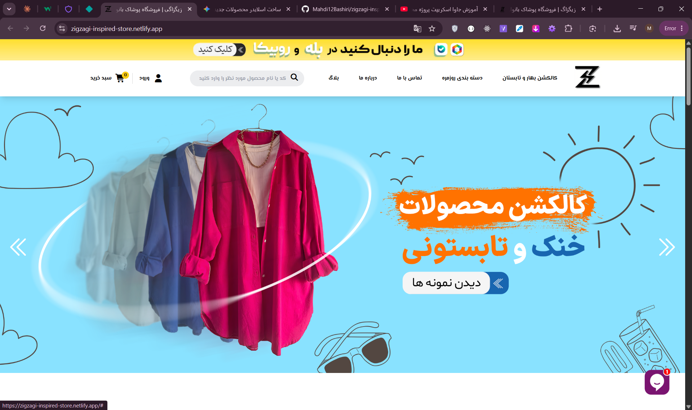
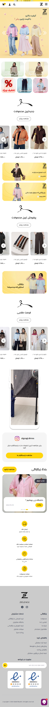

# 🛍️ Zigzagi Store

A modern and responsive fashion e-commerce frontend built with **Vanilla JavaScript**, **Vite**, **Tailwind CSS**, and **Axios**.

**Zigzagi** is an original fictional fashion brand created for this project. While the visual design takes inspiration from the **Zigzag** online store, the entire source code, project architecture, and implementation were developed independently from scratch, with many sections redesigned and customized.

---

## 🌐 Live Demo

🔗 https://zigzagi-inspired-store.netlify.app/

---

## 📸 Hero Preview



---

## 🎥 Demo


---

## 🖥️ Desktop Preview


---

## 📱 Mobile Preview



---

# ✨ Features

- ✅ Fully Responsive Layout
- ✅ Modern Fashion Store Landing Page
- ✅ Dynamic Header
- ✅ Mobile Navigation Menu
- ✅ Hero Slider (Swiper.js)
- ✅ Product Sliders
- ✅ Promotional Banner Sections
- ✅ Search Modal
- ✅ Data Rendering with Axios
- ✅ Modular JavaScript Architecture
- ✅ Component-based Code Organization
- ✅ Clean Folder Structure
- ✅ Optimized Images & Assets
- ✅ Deployed on Netlify

---

# 🛠 Tech Stack

| Frontend | Tools |
|-----------|-------|
| HTML5 | Vite |
| CSS3 | Axios |
| Tailwind CSS | Swiper.js |
| JavaScript (ES6+) | Font Awesome |
| JSON | Git & GitHub |

---

# 📂 Project Structure

```text
.
├── public/
│   ├── db.json
│   ├── favicon.svg
│   └── images/
│
├── screenshots/
│   ├── hero.png
│   ├── desktop.png
│   ├── mobile.png
│   └── demo.gif
│
├── src/
│   ├── assets/
│   │   └── fonts/
│   │
│   ├── css/
│   │   ├── style.css
│   │   └── tailwind.css
│   │
│   └── js/
│       ├── modules/
│       └── main.js
│
├── index.html
├── package.json
└── vite.config.js
```

---

# 🚀 Getting Started

Clone the repository

```bash
git clone https://github.com/Mahdi12Bashiri/zigzagi-inspired-store.git
```

Navigate to the project

```bash
cd zigzagi-inspired-store
```

Install dependencies

```bash
npm install
```

Start the development server

```bash
npm run dev
```

Run JSON Server (Development Only)

```bash
npm run server
```

---

# 📜 Available Scripts

```bash
npm run dev
npm run build
npm run preview
npm run server
```

---

# ⚙️ Development Workflow

During development, the project uses **JSON Server** together with **Axios** to simulate a REST API.

For the deployed version on **Netlify**, Axios automatically loads data from a local `db.json` file, preserving the same data-fetching architecture without requiring a backend service.

This approach keeps the production build fully static while demonstrating API-driven development.

---

# 🎯 What I Practiced

- Responsive Web Design
- Modern Frontend Workflow with Vite
- Modular JavaScript Architecture
- REST API Simulation
- Working with Axios
- DOM Manipulation
- Reusable Components
- Mobile-first UI Development
- Clean Project Structure
- Frontend Deployment

---

# 🚀 Future Improvements

- User Authentication
- Shopping Cart
- Wishlist
- Product Details Page
- Category Pages
- Product Filtering
- Product Sorting
- Search Functionality
- Dark Mode
- Better Accessibility
- Performance Optimization
- Backend Integration

---

# 📄 Disclaimer

This project was created for educational and portfolio purposes.

The project introduces an original fictional brand called **Zigzagi**.

The visual design is inspired by the **Zigzag** online fashion store, while the implementation, source code, architecture, and project structure were independently developed from scratch.

---

# 👨‍💻 Author

**Mahdi Bashiri**

GitHub:
https://github.com/Mahdi12Bashiri

---

⭐ If you like this project, feel free to give it a star!
